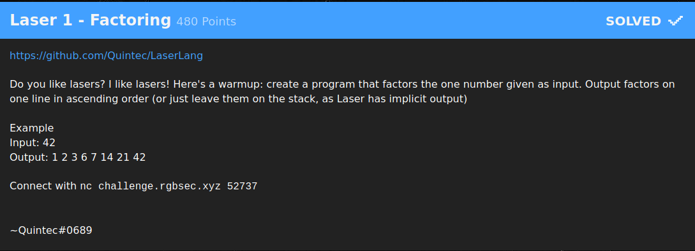
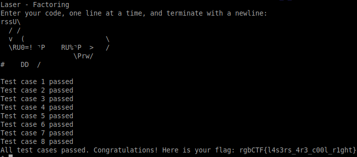

# Laser 1 - Factoring (480 Points)



2次元平面上を動くプログラミング言語([https://github.com/Quintec/LaserLang](https://github.com/Quintec/LaserLang))を使って与えられた課題を解くという問題。

```
rssU\
  / /
  v  (                    \
  \RU0=! ⌝P    RU%⌝P  >   /
                  \Prw/
#    DD  /
```



flag: rgbCTF{l4s3rs_4r3_c00l_r1ght}
