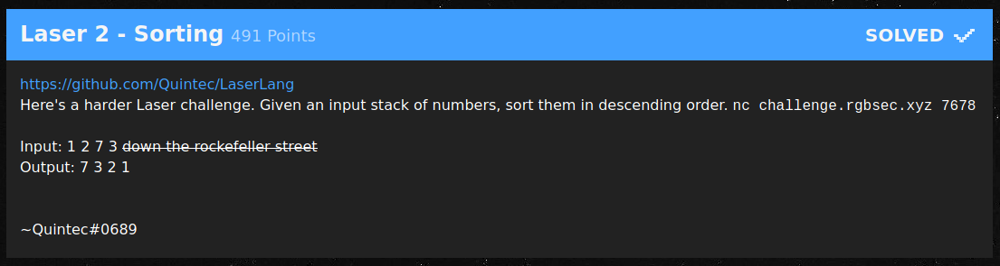
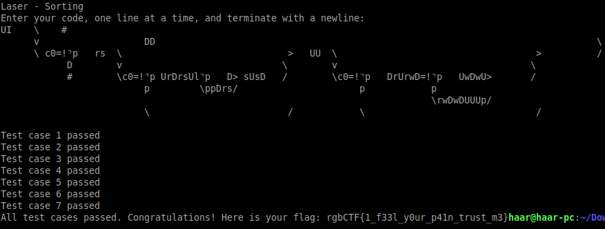

# Laser 2 - Sorting (491 Points)



与えられた数列をソートする問題。  
最大値(or 最小値)を順次探索する方針で解いた。

```
UI    \    #
      v                   DD                                                                        \
      \ c0=!⌝p   rs  \                              >   UU  \                                    >  /
            D        v                             \        v                                   \
            #        \c0=!⌝p UrDrsUl⌝p   D> sUsD   /        \c0=!⌝p   DrUrwD=!⌝p   UwDwU>       /
                          p         \ppDrs/                      p            p                
                                                                              \rwDwDUUUp/        
                          \                         /            \                               /
```



flag: rgbCTF{1_f33l_y0ur_p41n_trust_m3}
