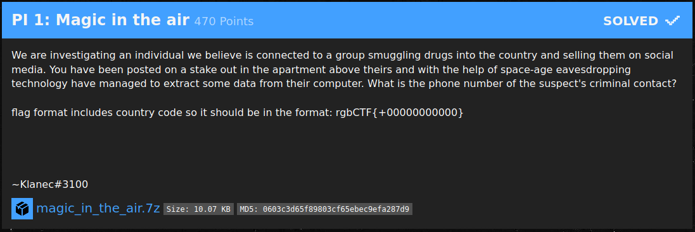
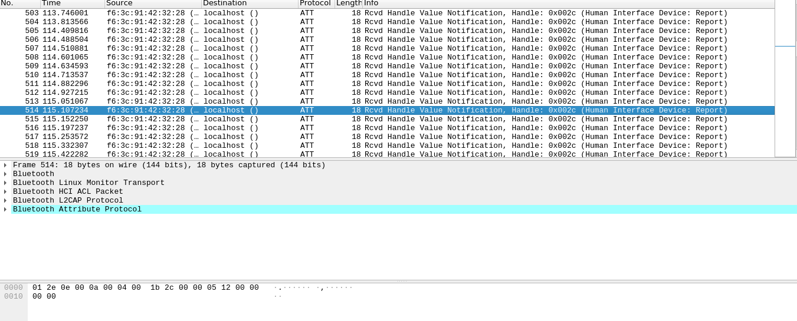
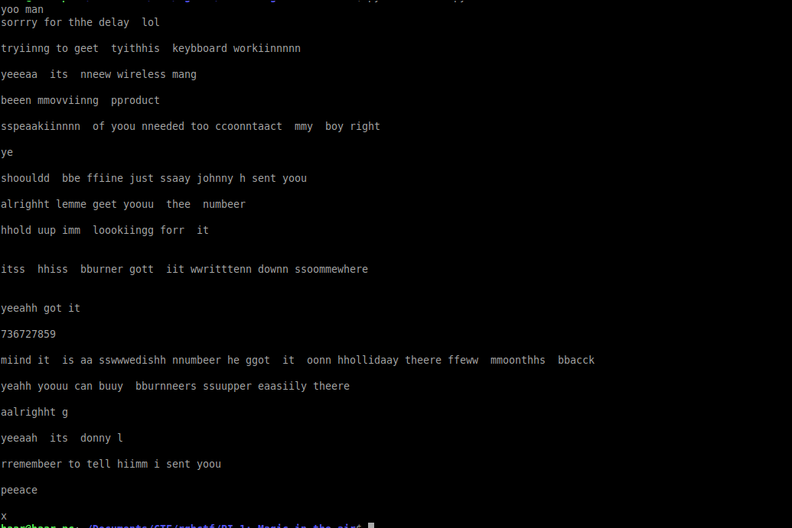

# PI 1: Magic in the air (470 Points)



7zファイルを解凍すると、`data`というファイルが出てくる。`file`コマンドで種類を確認すると、`BTSnoop version 1`というファイルであるとわかる。
少し調べると、これがbluetoothのログであり、wiresharkで開けることが判明するので、wiresharkで開く。



眺めていると、上のような通信が連続して大量にある。  
ここで、これはキーボードの入力のログだろうと推測できるので、[ここ](http://www.mindrunway.ru/IgorPlHex/USBKeyScan.pdf)を見ながらキー入力を抽出するスクリプトを書いた。

```python
import string

table = {}

table[0] = ""

for i, c in zip(range(0x04, 0x1d), string.ascii_lowercase):
    table[i] = c

table[0x2c] = " "
table[0x28] = "\n"

for i, c in zip(range(0x1e, 0x27), "1 2 3 4 5 6 7 8 9 0".split(" ")):
    table[i] = c

a = bytes([0x01, 0x2e, 0x0e, 0x00, 0x0a, 0x00, 0x04, 0x00, 0x1b, 0x2c, 0x00])

with open("./data", "rb") as f:
    data = f.read()

    for i in range(len(data)):
        if data[i:i+len(a)] == a:
            res = list(data[i+len(a):i+len(a)+7])

            print(table.get(res[1], ""), end="")

print()
```



電話番号は736727859、これにスウェーデンの国コード(+46)をつけるとflagが得られる。

flag: rgbCTF{+46736727859}
