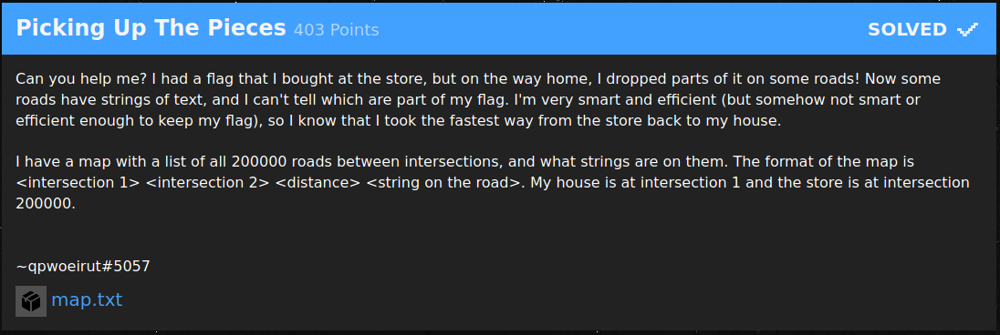
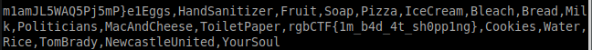

# Picking Up The Pieces (403 Points)



重み付き無向グラフ上の最短距離経路を辿って文字列を復元する問題。  
最短距離の更新の際に復元文字列の更新を行うようなDijkstra法で解ける。


```nim
import os
import sequtils
import strutils
import heapqueue

const N = 200000

var flag: seq[string] = newSeq[string](N)
var dist: seq[int] = newSeqWith(N, int.high)
var check: seq[bool] = newSeq[bool](N)

type E = tuple[to: int, cost: int, part: string]

var g: seq[seq[E]] = newSeq[seq[E]](N)

block:
  var f = open("map.txt", FileMode.fmRead)
  defer: 
    close(f)
    echo "closed"

  for l in f.lines:
    let res = l.split
    let u = res[0].parseInt - 1
    let v = res[1].parseInt - 1
    let d = res[2].parseInt
    let s = res[3]

    g[u].add((to: v, cost: d, part: s))
    g[v].add((to: u, cost: d, part: s))

echo "OK"

var hq = initHeapQueue[(int, int, string)]()

dist[0] = 0
hq.push((0, 0, ""))

while hq.len != 0:
  let (d, i, s) = hq.pop

  if check[i]: continue
  check[i] = true

  for e in g[i]:
    if dist[i] + e.cost < dist[e.to]:
      dist[e.to] = dist[i] + e.cost
      flag[e.to] = flag[i] & e.part
      hq.push((dist[e.to], e.to, flag[e.to]))

echo flag[N - 1]
```



flag: rgbCTF{1m_b4d_4t_sh0pp1ng}
