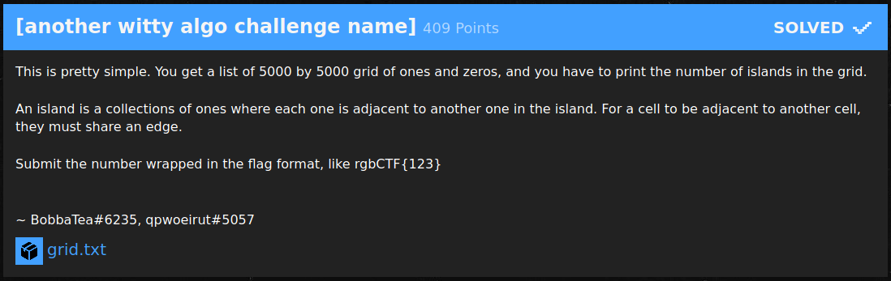
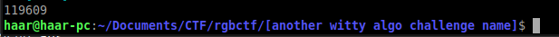

# [another witty algo challenge name] (409 Points)


5000×5000のグリッド上にある島の個数を数えよ、という問題。ここでは島は辺を共有する`1`セルの集まりとされている。  
これは各島をDFS等で探索すれば簡単に解ける。

```nim
import sequtils

let N = 5000
var grid: seq[string] = newSeqWith(N, stdin.readline)
var check: seq[seq[bool]] = false.repeat(N).repeat(N)

let dir = @[(-1, 0), (1, 0), (0, -1), (0, 1)]

proc dfs(i, j: int) =
  check[i][j] = true

  for (dx, dy) in dir:
    let x = i + dx
    let y = j + dy

    if x < 0 or y < 0 or x >= N or y >= N or check[x][y] or grid[x][y] == '0':
      continue

    dfs(x, y)

var ans = 0

for i in 0 ..< N:
  for j in 0 ..< N:
    if not check[i][j] and grid[i][j] == '1':
      ans += 1
      dfs(i, j)

echo ans
```



flag: rgbCTF{119609}
