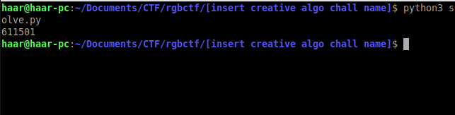

# [insert creative algo chall name] (449 Points)


[https://pastebin.com/pKNVLkTs](https://pastebin.com/pKNVLkTs)

非負整数 x, nが与えられる。 集合rを{2^0, 2^1, 2^2, ... , 2^(n-1)}とする。  
rを非空なx個の部分集合に分割することを考える。但し、これらの部分集合は互いに共通部分を持たず、また、すべての和集合はrに等しくなければならない。  
ここで、各部分集合の要素の和からなる集合を考える。重複を除いてこの集合は何通り存在するか？  

x = 4, n = 12のときの答えがflagである。


集合rの各要素をx個の部分集合のどれに割り当てるかを考えると、x^n通りのパターンを計算すれば良いことがわかる。


```python
def nozero(l):
    for x in l:
        if x == 0:
            return False
    return True

def asc(l):
    for i in range(len(l) - 1):
        if l[i] > l[i + 1]:
            return False
    return True

x = 4
n = 12

r = [2 ** i for i in range(n)]

a = []
b = [0 for _ in range(x)]

def rec(i):
    if i == n:
        if asc(b) and nozero(b):
            a.append(tuple(b))
    else:
        for j in range(x):
            b[j] += r[i]
            rec(i + 1)
            b[j] -= r[i]

rec(0)

print(len(set(a)))
```



flag: rgbCTF{611501}
