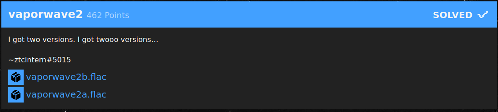
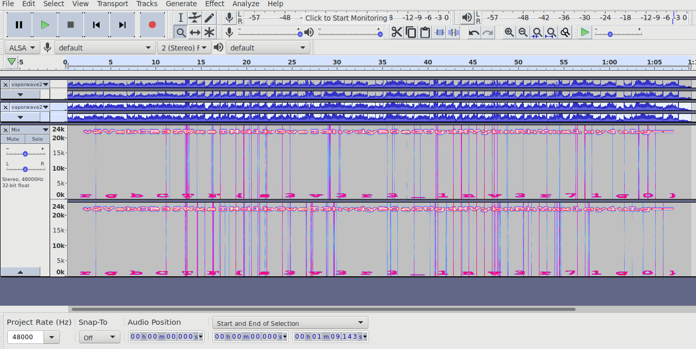
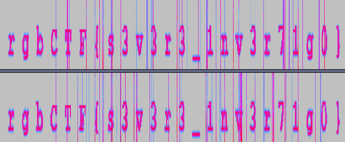

# vaporwave2 (462 Points)

2つのflacファイルが与えられている。差分を取るのかなと予想がつくのでAudacityで差分を得る。  
差分は、片方を上下反転して、Mixすると得られる。

上のbase64文字列"V2VsbCB3ZWxsIHdlbGwsIGhvdyB0aGUgdHVybnRhYmxlcy4uLg=="をデコードすると"Well well well, how the turntables..."という文が得られる。
(画像では先頭が小文字だが多分誤記)

flag: rgbCTF{s3v3r3_1nv3r71g0}
